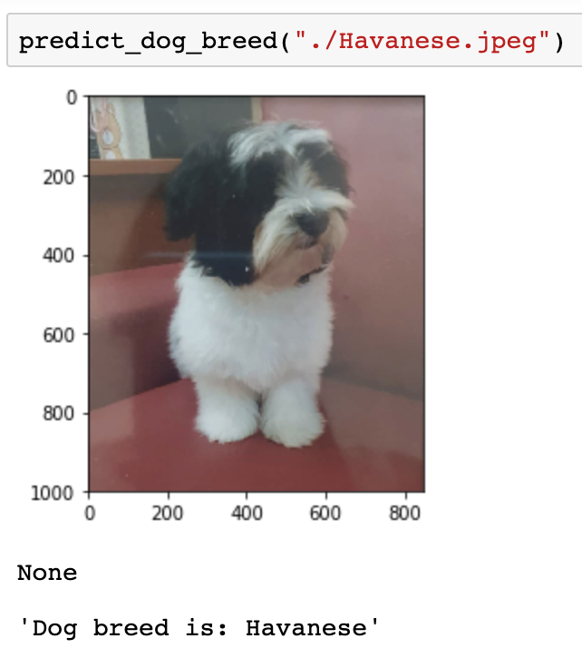
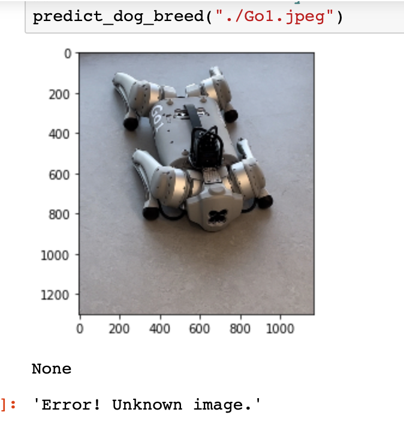
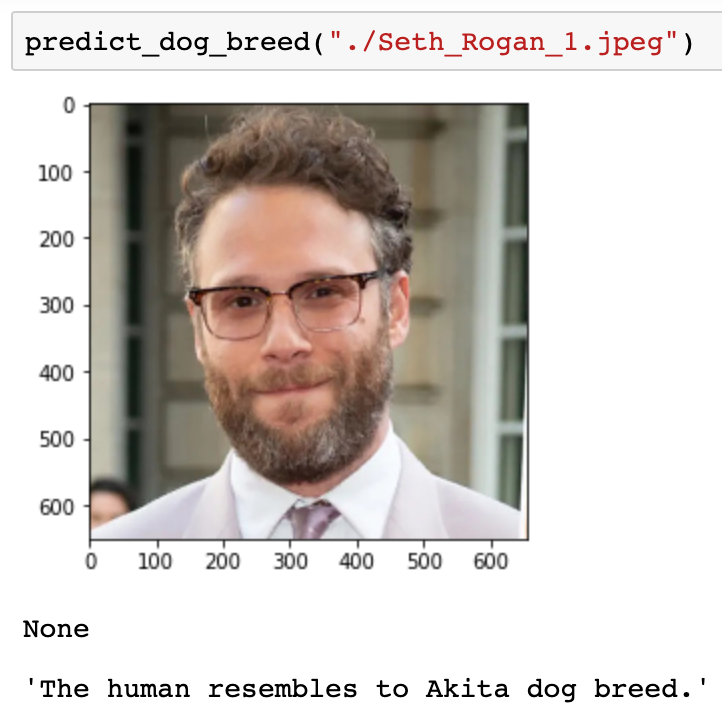
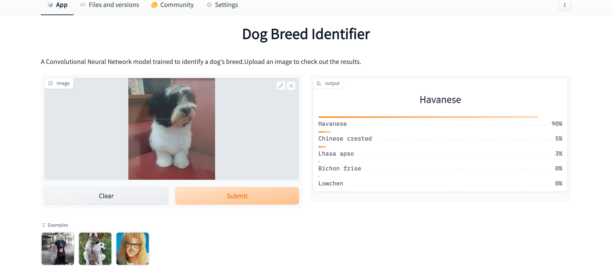

# Udacity's Data Scientist Nanodegree Capstone

## Convolutional Neural Networks for a Dog Identification App

## Project Description
The Capstone Project for Dog Identification is one of the most popular Udacity projects across Machine Learning and Artificial Intellegence Nanodegree Programs. Powerful ideas and approaches for addressing task classification are provided by the burgeoning and amazing fields of Deep Learning and Artificial Neural Networks. In this project, we have used deep learning principles to create concepts for a dog recognition app. The software is designed to accept any image input from the user. If a dog is found in the picture, an estimation of the breed will be given. If a human is detected, it will estimate the dog breed that most closely resembles a human.

## Project Motivation
Dog breed identification is crucial when rescuing dogs, providing them loving families, rehabilitating them, and several other  circumstances because dogs are frequently difficult to categorise merely by looking. The classification of a dog's breeds reveals more about the personality of the breed. Our fondness and passion for dogs inspired us to choose this initiative.

## Web Application
There is a web application that utilizes data to inform how the web application works. The application is hosted on `huggingface`. Click on the link below to direct you to the hugging face spaces.

<a href="https://huggingface.co/spaces/mehzhats/dogbreedidentifier">

</a>

# The Road Ahead

The steps involved in the project are as follows:

* [Step 0](#step0): Import Datasets
* [Step 1](#step1): Detect Humans
* [Step 2](#step2): Detect Dogs
* [Step 3](#step3): Create a CNN to Classify Dog Breeds (from Scratch)
* [Step 4](#step4): Use a CNN to Classify Dog Breeds (using Transfer Learning)
* [Step 5](#step5): Create a CNN to Classify Dog Breeds (using Transfer Learning)
* [Step 6](#step6): Write your Algorithm
* [Step 7](#step7): Test Your Algorithm


## Project Components
The project is divided in three major parts

### 1. ETL Pipeline
Data Processing Pipeline, to load data from source, merge and clean the data and save it in a SQLite database.

### 2. ML Pipeline
Machine Learning Pipeline, to load preprocessed data from the SQLite database, split the dataset into training and test sets, build and train the model using GridSearchCV and export the final model as pkl file.

### 3. Flask Web App
Web App to show data visualisation of the trained data using Plotly. An interactive portal is available to use model in real time.

## Getting Started

### Dependencies

1. Python 3.10.4
2. Machine Learning Libraries: NumPy, SciPy, Pandas, Sciki-Learn, Tensorflow, Keras
3. Image Processing Functionality: Pillow, Opencv-Python
4. SQLlite Database Libraqries: SQLalchemy
5. Web App and Data Visualization: Gradio, HuggingFace, Matplotlib, Plotly

A requirements.txt file is created to install all the dependencies needed for this project. To install them run following command.

```pip install -r requirements.txt```

## Authors
* [MehzHats](https://github.com/MehzHats)

## License
[](https://opensource.org/licenses/MIT)

## Datasets:
The follwoing datasets are provided inorder to use and access the file remotely or on your local computer.

[Dog dataset](https://s3-us-west-1.amazonaws.com/udacity-aind/dog-project/dogImages.zip).

[Human dataset](https://s3-us-west-1.amazonaws.com/udacity-aind/dog-project/lfw.zip).

## Instructions:

1. The following steps will provide a brief guideline to work through the model.

    - To create a CNN to Classify Dog Breeds (using Transfer Learning)
    You must use the bottleneck features from a different pre-trained model. Pre-computed features for all of the networks that are currently available in Keras is provided below:

        - VGG-19 bottleneck features
        - ResNet-50 bottleneck features
        - Inception bottleneck features
        - Xception bottleneck features

    The files are encoded as such:

    Dog{network}Data.npz
    where `{network}`, in the above filename, can be one of `VGG19`, `Resnet50`, `InceptionV3`, or `Xception`. Pick one of the above architectures, download the corresponding bottleneck features, and store the downloaded file in the bottleneck_features/ folder in the repository.

    `python models/train_classifier.py data/DisasterResponse.db models/classifier.pkl`

2. The Python notebook requires datasets provided by Udacity. However for the demo,
    - Run the following command
        `python app.py`

# Transfer Learning Result

The demonstration shows how transfer learning can be used to implement an algorithm for dog breed identification. In this project, Resnet50 model was used with transfer learning to identify dog breed. Test validation accuracy produced by the model is about 80%.

When a user uploads an image opencv is used to determine if the image is a human or not. Then the image is passed through a vanilla Resnet50 to predict whether the image has a dog or not. If a face or a dog is detected in the image, then the image is passed through a model that was trained to predict dog breeds.

## Screenshots

1. The model identifying the dog breed.



2. Model when neither human nor dog is detected.



3. Model identifying what breed of dog the human resembles.



4. Web app for dog breed identifier.



5. The follwing is the screen recording of demo of the web app.

<video src="screenshots/dog_ident_record.mov" width=600 />

## Acknowledgements

* [Udacity](https://www.udacity.com/) Data Scientist Capstone Project
